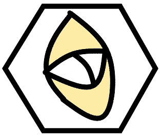

---
output:
  github_document:
    html_preview: true
---

<!-- README.md is generated from README.Rmd. Please edit that file -->


```{r, echo = FALSE}
knitr::opts_chunk$set(
  collapse = TRUE,
  comment = "#>",
  fig.path = "man/figures/README-"
)
```

# reliable 
[](https://travis-ci.org/JonasMoss/reliable)
[](https://ci.appveyor.com/project/JonasMoss/reliable)
[](https://codecov.io/gh/JonasMoss/reliable?branch=master)
[](https://www.repostatus.org/#wip)

An `R` package for reliability coefficients and factor scores for the linear
factor model. 
```{r setup, include=FALSE}
library("attenuation")
knitr::opts_chunk$set(echo = TRUE)
knitr::opts_chunk$set(out.width='750px', dpi=200)
```

## Installation
From inside `R`, use the following command:
```{r install, echo = TRUE, eval = FALSE}
# install.packages("devtools")
devtools::install_github("JonasMoss/reliable")
```

## Usage
Use `lavaan` to fit a linear factor model.

```{r lavaan, echo = TRUE, eval = TRUE}
library("reliable")

model = ' visual  =~ x1 + x2 + x3
          textual =~ x4 + x5 + x6
          speed   =~ x7 + x8 + x9 '

object = lavaan::cfa(model = model,
                     data = lavaan::HolzingerSwineford1939)
```

Now you we can find the sum-score reliability and the associated factor
scores.

```{r sumscore, echo = TRUE, eval = TRUE}
reliability(object, type = "sumscore")
```

And we can find the linear reliability and the associated factor scores.

```{r linear, echo = TRUE, eval = TRUE}
reliability(object, type = "linear")
```

## How to Contribute or Get Help
If you encounter a bug, have a feature request or need some help, open a [Github issue](https://github.com/JonasMoss/reliable/issues). Create a pull requests
to contribute. This project follows a [Contributor Code of Conduct](https://www.contributor-covenant.org/version/1/4/code-of-conduct.md).
